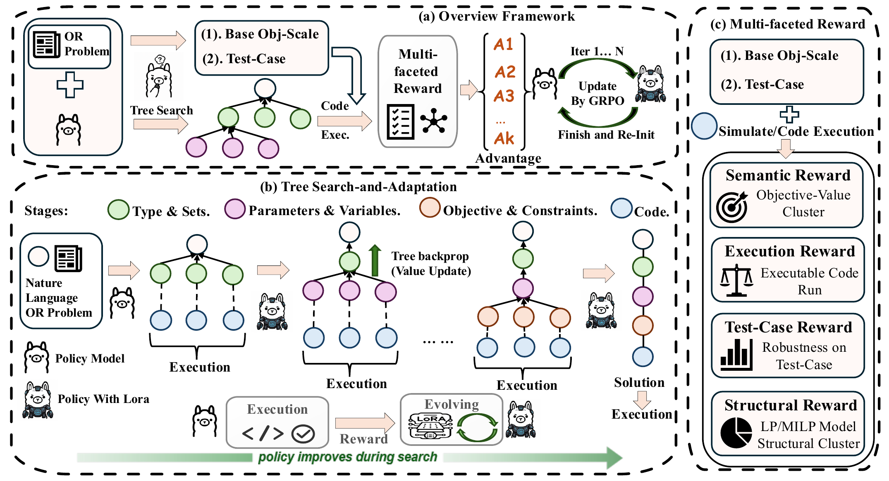

<div align="center">

# StarOR

**Synergizing Tree Search and Test-Time Reinforcement Learning for Optimization Modeling**

[Paper: arXiv](https://arxiv.org/pdf/2606.15197v1)

</div>



StarOR is a search-and-adaptation framework that translates natural-language
operations research problems into executable optimization models. It combines
four-stage Monte Carlo Tree Search (MCTS) with instance-level GRPO updates to a
transient LoRA adapter, so the policy improves while exploring the formulation
of the current problem.

## Highlights

- **Structured formulation search.** StarOR decomposes modeling into type and
  sets, parameters and variables, objective and constraints, and executable
  code.
- **Test-time policy adaptation.** MCTS sibling candidates form local GRPO
  groups that update a sample-specific LoRA adapter.
- **Execution-grounded rewards.** Semantic consensus, code execution,
  synthetic test cases, and model structure provide feedback without using
  ground-truth labels during search.
- **Paper configuration included.** The canonical launch script contains the
  Qwen3-4B, `K=8`, `T=10`, LoRA, and dynamic reward settings used in the paper.

## Requirements

- Python `>=3.10`
- Linux with an NVIDIA GPU and a CUDA-compatible PyTorch installation
- Gurobi with a valid `gurobipy` license
- The Ray, vLLM, and FSDP dependencies required by the bundled `verl` runtime

The paper experiments use Qwen3-4B-Instruct-2507 on one NVIDIA H20 140GB GPU.
Other GPUs may require adjusting rollout memory utilization, offloading, or
tensor parallelism.

## Installation

After cloning the repository, create an environment with the GPU stack
appropriate for your CUDA version, then install StarOR in editable mode:

```bash
cd StarOR
pip install -e ".[hf,dev]"
```

The repository does not pin a universal CUDA, PyTorch, vLLM, or Gurobi build.
Install those platform-specific dependencies before launching a full run.

## Quick Start

The canonical paper configuration is
[`examples/ttrl-or/run_staror.sh`](examples/ttrl-or/run_staror.sh).

```bash
MODEL_NAME_OR_PATH=Qwen/Qwen3-4B-Instruct-2507 \
TRAIN_FILE="$PWD/data/IndustryOR_fixedV2.jsonl" \
bash examples/ttrl-or/run_staror.sh
```

For a local model checkpoint:

```bash
MODEL_NAME_OR_PATH="$HOME/models/Qwen3-4B-Instruct-2507" \
TRAIN_FILE="$PWD/data/OptMATH_Bench_166.jsonl" \
OUTPUT_DIR="$PWD/outputs/optmath" \
bash examples/ttrl-or/run_staror.sh
```

Additional Hydra overrides can be appended to the command. The legacy
`run_ttrl_or.sh` filename is retained as a wrapper for existing workflows.

## Paper Configuration

| Component | Setting |
|---|---|
| Backbone | Qwen3-4B-Instruct-2507 |
| Search | MCTS, `T=10`, `K=8`, `c_puct=1.414` |
| Policy prior | temperature `0.7` |
| Adaptation | online GRPO, learning rate `1e-4` |
| LoRA | rank `8`, alpha `16`, all linear layers |
| Sampling | temperature `1.0`, top-p `0.95` |
| Response length | `4096` tokens |
| Reward weights | `(0.2,0.5,0.2,0.1)` -> `(0.4,0.4,0.1,0.1)` -> `(0.6,0.2,0.1,0.1)` |
| Robustness tests | `3` synthetic cases |
| Solver limit | `30` seconds per execution |

The tuple order is semantic, execution, test-case, and structural reward.

## Data

The five evaluation datasets used in the paper, NL4OPT, MAMO-Easy,
MAMO-Complex, IndustryOR, and OptMATH, are based on the cleaned benchmark files
released with [SIRL](https://github.com/Cardinal-Operations/SIRL/tree/main/test_data).
See [`data/README.md`](data/README.md) for the corresponding corrections and
sample counts.

Normalize a dataset into the runtime format with:

```bash
python tools/normalize_data.py \
  --input data/IndustryOR_fixedV2.jsonl \
  --output data/unified/IndustryOR_fixedV2.unified.jsonl
```

Evaluate generated logs with:

```bash
python tools/eval_acc.py \
  --log-root outputs/staror-paper \
  --dataset-json data/IndustryOR_fixedV2.jsonl
```

## Repository Structure

```text
StarOR/
├── assets/                         # README and project figures
├── data/                           # Benchmarks and data preparation
├── examples/ttrl-or/               # Canonical and compatibility launchers
├── tools/                          # Normalization and evaluation utilities
├── verl/trainer/staror_runtime/    # MCTS, rewards, prompts, and pipeline
├── verl/trainer/ppo/staror_fit.py  # StarOR integration with the verl trainer
└── verl/utils/dataset/             # StarOR dataset adapter
```

StarOR is implemented on top of the bundled `verl` codebase. The custom fit
branch is activated by `algorithm.staror.enable=True`.


## Citation

The arXiv record and BibTeX entry will be added when the paper is public.

```bibtex
@misc{li2026starorsynergizingtreesearch,
      title={StarOR: Synergizing Tree Search and Test-Time Reinforcement Learning for Optimization Modeling}, 
      author={Jiajun Li and Yu Ding and Shisi Guan and Ran Hou and Wanyuan Wang},
      year={2026},
      eprint={2606.15197},
      archivePrefix={arXiv},
      primaryClass={cs.LG},
      url={https://arxiv.org/abs/2606.15197}, 
}
```

## License

The code in this repository is released under the MIT License.

